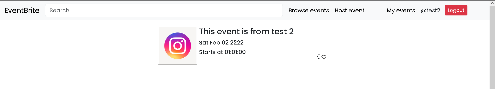

# Event brite

# !each user has a id == "user_id whic is used to check which event is whose
#MY SQL configuration

mysql={
    user: root,
    pass:root,
    databse:django,
}

django configurations is given in settings.py

#/backend/api
    The backend rest api to add users, reterive users, add events, retrive users
    Usermodel -  /backend/api/models
    Serializers -  /backend/api/serializer
    Views -  /backend/api/views
    urls -  /backend/api/urls

django server port :8000
react port : 3000

# H1 Hosting events from different users

#
<!--  -->
# Events table in database

# Events object 

# host an event

<!--  -->
# Loginpage

#  My events page {userspecific events page}

# Signup page

# Events page all events visible

# users

# users table 
